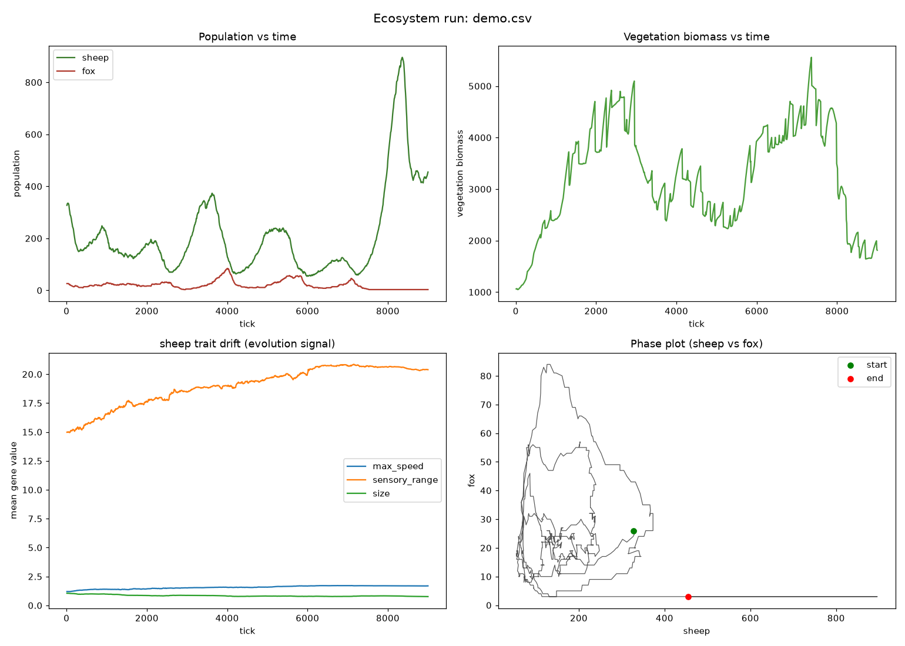

# darwinism — a world for agents


A living **world for agents**, `darwinism` grows a whole planet —
**terrains and biomes** (ocean, rivers, forest, grassland, mountains), **hydrology**, and
**weather and seasons** that cycle as virtual days pass — then let agents in it to
hunt, flee, drink, breed, and evolve.

Build for AI:

- **Agents see through their own eyes.** Each animal perceives only its **local**
  surroundings — food, threats, mates and water within its own heritable vision range, centred
  on itself — as **egocentric perception grids**: pure numbers, ready to feed straight into a
  neural network. No global "nearest target", no omniscience.
- **Brains are swappable.** Every decision flows through one
  `brain.decide(observation) -> action` contract. The default world runs on hardcoded rules,
  but a **PyTorch brain drops in behind the same contract with zero sim rewrite**
- **Evolution is real, not scripted.** Every animal carries a **heritable genome** — speed,
  vision range, metabolism, size, lifespan, aggression and more — **sampled from probability
  distributions** rather than hardcoded. When two mates breed, each child's genes come from
  **per-gene crossover of both parents plus gaussian mutation**, so traits drift and
  populations adapt across generations.
- **Time is just another parameter.**, Configure `dt` so one real second can represent a second, a day, or even years of simulated time. Observe every moment interactively, or race through generations of evolution in high-speed, headless simulations.
- **Headless and deterministic.** Run it as a pure-numbers simulator with no display, or
  watch it live in an Arcade window — the same core either way. Two seeds (world + run) make
  **every run byte-for-byte reproducible**.

**AI-friendly by design.** The building blocks are the kind machine learning speaks natively:
perception arrives as **tensors** (CNN-ready egocentric channels), decisions come out as
**continuous headings and probability gates** instead of hard branches, and genes are **sampled
from probability distributions** and recombined with crossover + mutation. Everywhere a
hardcoded rule sits today, a learned, differentiable model can slot in without a rewrite.

And it's a **framework, not just an app**: `import darwinism`, compose a `Config`, and extend
around four points — **species**, **brains**, **systems**, and heritable **traits** —
without touching the core.

## Quickstart

```python
import darwinism as dw

cfg = dw.make_config(world_seed=12345, seed=7)   # world seed + run seed (both reproducible)
sim = dw.Simulation(cfg)                          # default RuleBrain drives every species
for _ in range(5000):
    stats = sim.step()
print(sim.populations)                            # {'sheep': ..., 'fox': ...}
```

**Extending it** — add a species, a tick-system, a trait, or a brain, all as composition. See
**[EXTENDING.md](EXTENDING.md)** and runnable **[`examples/`](examples/)**:

```python
RABBIT = 2
cfg.species[RABBIT] = dw.SpeciesConfig(
    name="rabbit", species_id=RABBIT, init_count=90,
    diet=[dw.FieldFood("vegetation", eat_value=0.7)],       # herbivore
    gene_ranges={"max_speed": dw.GeneRange(0.8, 2.2), "burrow_depth": dw.GeneRange(0, 1), ...},
)
sim = dw.Simulation(cfg, systems=[*dw.default_pipeline(cfg), MyDiseaseSystem()],
                    brain={RABBIT: MyBrain()})
```

## Install

`darwinism` is GitHub-installable. The core (headless simulator) needs only `numpy` +
`opensimplex`; heavy pieces are optional extras that mirror the code's lazy-import boundaries.

```bash
pip install "git+https://github.com/afreediz/darwinism.git"           # core, headless
pip install "darwinism[render] @ git+https://github.com/afreediz/darwinism.git"   # + Arcade viewer
pip install "darwinism[torch]  @ git+https://github.com/afreediz/darwinism.git"   # + learned PolicyBrain
```

Extras: `analysis` (pandas + matplotlib for the CSV report), `render` (Arcade viewer),
`torch` (learned policies), `dev` (pytest, ruff, import-linter), `all`. For local development:

```bash
python -m venv venv
venv/Scripts/activate          # Windows;  source venv/bin/activate on Unix
pip install -e ".[all,dev]"
```

Installing adds two console scripts, `darwinism-run` (headless) and `darwinism-live` (viewer);
`python -m darwinism [run|live]` and the root `run_experiment.py` / `run_live.py` shims are
equivalent.

## Run

**Watch live** (Arcade observer window):

```bash
# default world, random run
darwinism-live

# with world configs
darwinism-live --world-seed 12345 --seed 7 --scale 5 --spf 4

# with trained pytorch brains
darwinism-live --world-seed 1 --seed 7 \
 --sheep-brain notebooks/imitation_learning/sheep.pt \
 --fox-brain notebooks/live_learning/offline/fox_offline_ppo.pt \
 --device cuda
```

CLI flags: `--world-seed N` (terrain/rivers; same world-seed ⇒ identical map) · `--seed N`
(run dynamics; omit for a random run on that world) · `--scale N` (pixels per world cell) ·
`--spf N` (sim steps per rendered frame; fractional ok, e.g. `0.25` = 1 step every 4 frames) ·
`--log-csv PATH` (also log this live run to a CSV) · `--monitor` (open a separate live analysis
window — see [Live monitor](#live-monitor); defaults `--log-csv` to `runs/live.csv`).

### Live viewer controls

| Key / input | Action |
|---|---|
| `SPACE` | pause / resume |
| `↑` / `↓` | sim speed up / slow down (×2 / ÷2 steps-per-frame) |
| `+` / `-` / `=` | zoom in / out (centered on screen) |
| mouse wheel | zoom in / out (centered on cursor) |
| middle-drag | pan the map |
| `0` | reset view (refit the whole map) |
| `V` | toggle the vegetation overlay |
| `Ctrl+V` | freeze / unfreeze vegetation regrowth (grazing still depletes it) |
| `S` | fast-forward the season (+0.1 year) |
| `Ctrl+S` | pause / resume seasonal progression (day & weather keep running) |
| `Shift+S` | spawn a sheep at the cursor |
| `Shift+F` | spawn a fox at the cursor |
| left-click | inspect an animal's perception — ring it and show its egocentric grid channels |
| `ESC` | quit |

The viewer is an **observer only** — these controls never feed back into the measured
simulation, except manual spawning (`Shift+S` / `Shift+F`), which draws from the run RNG
and so breaks run reproducibility (the headless path never spawns manually).

On-screen markers: a small black dot = male · a rose tint = bred in the last few ticks ·
dimmed = asleep · the whole scene darkens at night. Left-click any animal to open a
top-right panel showing its live perception grids (terrain / water / food / threat / mate).

**Headless experiment** (fast-forward, writes CSV):

```bash
darwinism-run --ticks 20000 --world-seed 12345 --seed 7 --out runs/run.csv
darwinism-run --ticks 20000 --world-seed 12345    # random run on a fixed world
darwinism-run --ticks 20000 --plot                # also render a PNG report
darwinism-run --ticks 20000 --monitor             # watch the plots update live
```

`--world-seed` fixes the map; `--seed` fixes the run (omit for a random run — the resolved
seed is printed at startup so you can replay it). `--log-every N` sets how often a CSV row is
written (default every 10 ticks). `--monitor` opens a separate live analysis window (below).

**Analysis** (population curves, trait drift, phase plot):

```bash
python -m darwinism.analysis.plots runs/run.csv --out analysis/out
```

Each run produces a 4-panel report — population vs time, vegetation biomass, sheep trait
drift (the evolution signal), and the sheep–fox phase plot (the Lotka–Volterra loop):



### Live monitor

`analysis.monitor` opens a **separate window** (independent of the sim) that tails a run CSV
and re-draws the same 4-panel report on an interval — so you can watch population curves,
trait drift and the phase plot evolve while a run is still going.

```bash
# automatic: launch the monitor alongside a run (spawned as its own process)
darwinism-run --ticks 20000 --world-seed 12345 --seed 7 --monitor
darwinism-live --world-seed 12345 --seed 7 --monitor

# standalone: point it at ANY run CSV — one still being written, or a finished one
python -m darwinism.analysis.monitor runs/run.csv --interval 1.0
```

`--interval` sets the refresh period in seconds (default `1.0`). The monitor tolerates an
empty/header-only file, so it can start before the first row is written. It needs a display
(matplotlib `TkAgg` backend), so it can't run in a headless shell. With `--monitor`, the
sim window closes independently and the monitor window stays open showing the final data.

## Architecture (the non-negotiables)

- **`sim/` is pure numbers and never imports `render/`.** Both entry points share the
  exact same `sim/` core. The Arcade renderer is an optional, read-only observer.
- **The brain↔world contract is the spine.** Every decision flows through
  `Brain.decide(obs_by_species, idx) -> act`: each species gets egocentric perception grids
  `(N, C, K, K)` + a scalar vector, the brain returns the `(len(idx), ACT_DIM)` action matrix
  aligned to the global alive ordering. v1's `RuleBrain` is throwaway; the per-species grid/
  scalar schemas (`sim/perception.py`, `sim/brain.py`) are the real design.
- **Entity state is Structure-of-Arrays** (`sim/entities.py`) — parallel NumPy arrays, not
  one object per entity.
- **Perception is local-only** — each agent perceives food/threats/mates/water only within
  its heritable `sensory_range`, as masked egocentric grids; never a global "nearest". Blind
  time becomes exploration.
- **Determinism, two seeds**: the **world seed** drives world generation (terrain + rivers);
  the **run seed** drives all dynamics via one `numpy` Generator (from `config.py`) threaded
  into every system. Fixed `dt`, iteration by slot index. Same world seed + config + run seed
  ⇒ identical run; a different run seed ⇒ a different run on the same world.

## Layout

```
pyproject.toml       packaging (hatchling; core + [render]/[torch]/[analysis]/[dev] extras)
darwinism/           the package (flat layout)
  __init__.py        public API (Simulation, Config, Brain, System, ...) + __version__
  config.py          all tunables + world seed + run seed + declarative SpeciesConfig/diet
  sim/               headless core (world, hydrology, environment, entities, genome,
                     perception, brain, grid, systems/ incl. the pipeline registry)
  render/viewer.py   Arcade observer (never mutates the sim)
  analysis/          CSV logger + matplotlib plots + live monitor window
  cli/               console-script entry points (experiment, live)
examples/            runnable extension examples (species, system, brain)
tests/               golden-master determinism suite + extension tests
run_experiment.py / run_live.py   thin back-compat shims -> darwinism.cli
```

---

## License

**darwinism Non-Commercial Research License v1.0** — see [LICENSE](LICENSE).

Free to use, modify, and share for **personal, academic, research, and educational**
purposes, with attribution ("darwinism by Afreedi Z. — github.com/afreediz"). Public
derivatives of the core simulation must be shared back under the same license.

**Commercial use requires a separate written agreement** — contact
afreedisulfiker@gmail.com.

---

⭐ If you like this project, give it a star — it helps a lot and is much appreciated!

### Made with ❤️ by Afreedi Z.